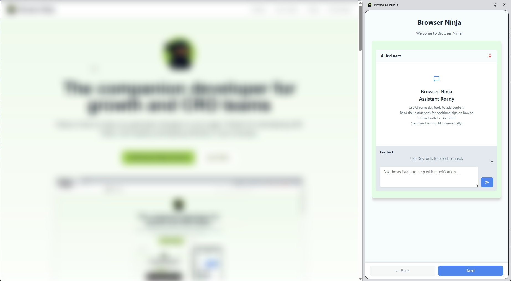

# Browser Ninja

[**Website**](https://jatacid.github.io/browser-ninja)

**Ask to change something on a webpage, Browser Ninja will get it done.**

Browser Ninja is a Chrome extension sidepanel that is trained to understand your requests and execute them on the current webpage. Simply tell it what you want to change, and watch it figure out exactly what is needed.

## Features

- **Context Aware**: Inspect elements in DevTools and Browser Ninja will know what you're talking about.
- **AI Powered**: Uses OpenAI's GPT models to generate vanilla JavaScript snippets.
- **Auto-Run**: Save your favorite snippets to run automatically when you visit a site.
- **Privacy Focused**: Your API key is stored locally. No intermediate servers.

## Installation

1.  **Download**: Clone this repository or download the ZIP.
2.  **Load in Chrome**:
    - Go to `chrome://extensions/`
    - Enable **Developer mode** (top right).
    - Click **Load unpacked**.
    - Select the `browser-ninja` folder from this repository.

## Setup

1.  Open the Browser Ninja sidepanel.
2.  Go to the **Settings** tab.
3.  Enter your **OpenAI API Key**.
    - You can get one from [OpenAI Platform](https://platform.openai.com/api-keys).

## Usage

1.  **Inspect**: Open Chrome DevTools and inspect an element.
2.  **Chat**: Ask Browser Ninja to modify it.
    - *Example: "Change the background color to blue"*
    - *Example: "Hide this element"*
    - *Example: "Extract all links from this list"*
3.  **Run**: Click the "Run" button to execute the code.
4.  **Save**: Click the "Save" button to keep the snippet for later.

## How Snippets Work

Browser Ninja builds JavaScript snippets in the format `[trigger[observer[code]]]`. Each component plays a crucial role:

- **[trigger]**: Events that initiate the snippet: page load, URL changes, clicks, or hovers. Defaults to page loading.
- **[observer]**: Monitors for elements or conditions before running the code (e.g., waiting for an element to appear).
- **[code]**: The actual JavaScript that performs the modification.

## Tips

- **Build Incrementally**: Start with small changes and build up to complex scripts.
- **Refine & Test**: Run the code directly from the chat to test before saving.
- **Save Snippets**: Once happy with a script, save it so it runs automatically next time you visit the site.
- **Context Gathering**: If Browser Ninja needs more information, it will ask you to gather more context about the page.

## Development

### Structure

- `browser-ninja/`: The Chrome extension source code.
    - `manifest.json`: Extension manifest.
    - `sidepanel.html/js`: Main UI logic.
    - `sidepaneljs-chatModule.js`: Chat interface and OpenAI integration.
    - `background.js`: Service worker.
- `docs/`: Documentation website (hosted on GitHub Pages).

### Contributing

Pull requests are welcome! For major changes, please open an issue first to discuss what you would like to change.

## Support

If you find Browser Ninja helpful, consider buying me a coffee:

[☕ Donate](https://www.paypal.com/donate/?hosted_button_id=9VFG2KJ8HW6EW)

## License

[MIT](LICENSE)
